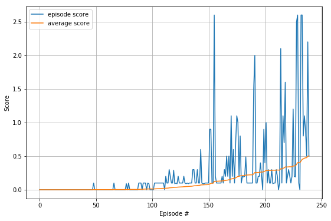

# Udacity DRL Collaboration And Competition Project Report

### Algorithm Overview
The agent model is based on the Deep Deterministic Policy Gradients (DDPG) algorithm, which leverages the Actor-Critic networks. Both agents share the same Actor and Critic models. Before starting with DDPG I tried several MADDPG implementations with separate Actor-Critic, but found that its learning was slow and instable. In most successful MADDPG implementations the environment could solved with about 3000 episodes. Thus, I decided to switch to DDPG which started showing better progress from the beginning. After tuning hyperparameters the environment has been solved with N episodes.

The Actor network hyperparameters:
* Hidden layers: 2
* 1st hidden layer nodes (FC): 400
* 2nd hidden layer nodes (FC): 300
* Output layer nodes (actions): 4
* Input parameters (states): 33
* Activation function: ReLU (except output - tanh)

The Critic network hyperparameters:
* Hidden layers: 2
* 1st hidden layer nodes (FC): 400
* 2nd hidden layer nodes (FC): 300
* Output layer nodes (Q-value): 1
* Input parameters (states): 33
* Activation function: ReLU

### Training
The agent model was trained on AWS (P3.2xlarge).
The following hyperparameters were used:
* Optimizer: Adam
* Replay buffer size: 100000
* Minibatch size: 128
* Discount factor (Gamma): 0.99
* Learning rate (Actor): 0.0001
* Learning rate (Critic): 0.001
* L2 weight decay: 0

The agent was able to solve the environment (30+ scores) in 125 episodes within 32 minutes:

```
Episode 100	Average Score: 22.50	Score: 33.027
Episode 125	Average Score: 30.07	Score: 29.316
Environment solved in 125 episodes!	Average Score: 30.07
```



### Future Ideas
To improve the agent's performance the following techniques can be used:
- examine MADDPG (separate Actor/Critic) and tune hyperparameters
- change network layers/nodes and choose different hyperparameters
- try other algorithms like PPO, A3C or D4PG
- use prioritised experience buffer
